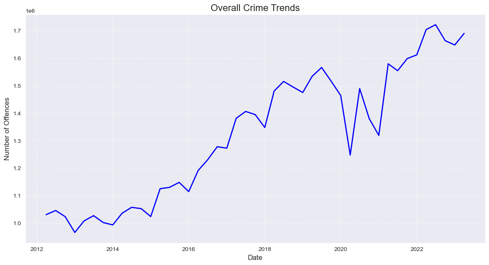
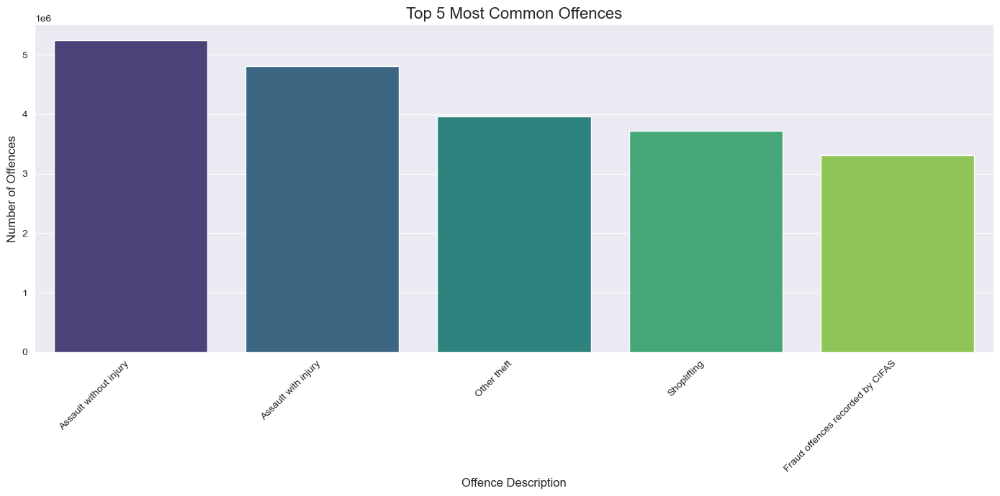
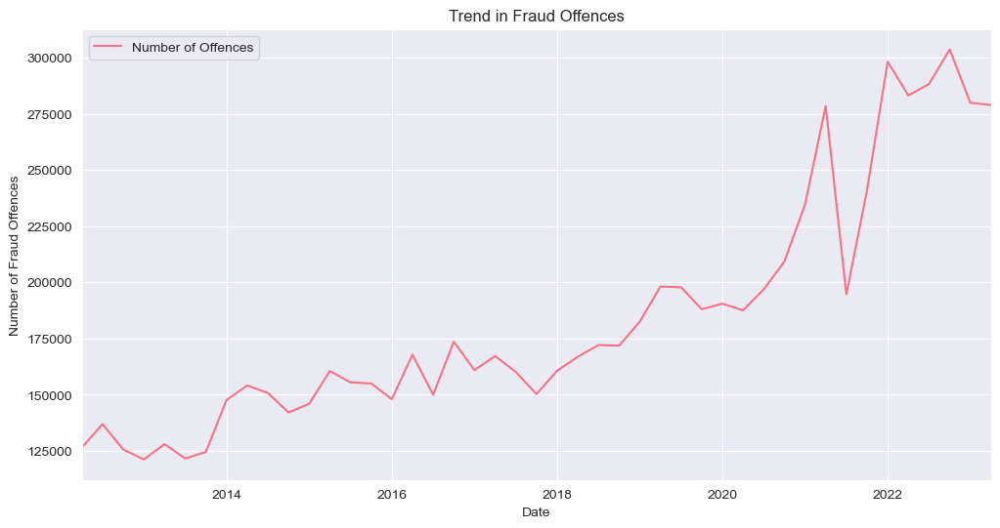
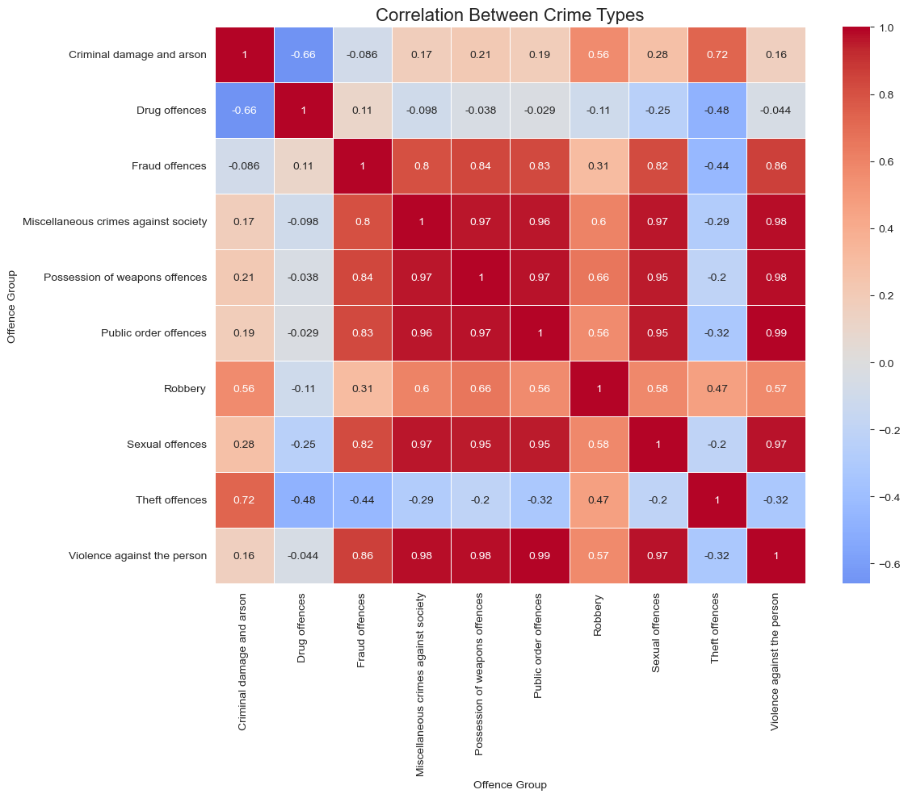

# Advanced Data Analytics - Portfolio Project
## Project Overview
This repository contains the dataset and project files for the Advanced Data Analytics portfolio project as part of the Advanced Data Analytics training at Datafied Academy. This project focuses on analyzing large datasets using big data technologies such as SQL and Python. The analysis is complemented with visualizations produced using Python and Power BI or Google Looker Studio.

## Learning Outcomes
- LO1: Critically exemplify the skills required for effectively representing, structuring, analyzing, manipulating, and accessing large datasets.
- LO2: Identify and critique significant current issues in the implementation and use of a range of Big Data Analytics Strategies.
- LO3: Integrate various computing technologies to provide an effective solution for a set of data-driven business requirements.

### Sections A. Data Analysis (75%)
- **Research Questions:** Clearly draft research questions based on the provided dataset.
- **Dataset Creation:** Merge or create a new dataset using SQL queries or Python.
- **Data Preprocessing:** Perform cleaning and preprocessing of the dataset.
- **Visualization:** Use Python, Power BI, or Google Looker Studio for data visualization.

### Issues and Solutions (25%)
- Identify significant issues in using Big Data Analytics, especially for crime analysis.
- Propose effective solutions using big data technologies.

## Project Structure
- data/: Folder containing the datasets used for analysis.
- notebooks/: Jupyter notebooks with data preprocessing, analysis, and visualization.
- visualizations/: Folder containing Python scripts and Power BI/Google Looker Studio files used for data visualization.
- presentation/: Folder containing the presentation materials for the project.

### Notes
Ensure that all code, results, and visualizations are well-documented and saved.
All outputs must be included in the final report following the provided format.

### Report Submission
Submit a report detailing the steps followed in this project, including:
- Research questions
- SQL queries
- Data cleaning and analysis
- Visualizations and insights

Deadline: September 30, 2024

Presentation Dates: October 5-6, 2024


# Police Recorded Crime Data Analysis Project
This data analysis project aims to explore police-recorded crime statistics focusing on trends, patterns, and potential correlations. 

Analyzing the dataset will help with insights into the nature of crime, identify areas of concern, and inform evidence-based policy decisions.

This project will leverage the available dataset in a `**Microsoft Excel Document**`, which includes information on crime types, locations, and periods.

Through data cleaning, exploratory data analysis, and statistical modeling, the aim is to:

- **`Identify trends`**: Analyze changes in crime rates over time for different crime types.
- **`Explore patterns`**: Examine variations in crime occurrence and identify hotspots.
- **`Analyze correlations`**: Investigate relationships between crime types, demographics, and other relevant factors.
- **`Provide insights`**: Offer recommendations based on the findings to inform crime prevention strategies and policy development.
 
By conducting a comprehensive analysis of police-recorded crime data, this project will contribute to a better understanding of crime trends and support evidence-based approaches to addressing crime-related challenges.


## Overview
This project aims to explore trends and relationships in police-recorded crime data, using various statistical and visual tools. The dataset includes offenses reported across different police forces, years, and types of crimes. The analysis will provide insights into how crime rates have evolved over time and uncover correlations between different types of crimes.

Key questions addressed include:
- How have overall crime trends changed over time?
- What are the most common offenses?
- How have specific crime categories, such as fraud and violent crimes, evolved?
- Is there a correlation between different types of crimes?
- How do crime rates vary across police forces?

## Rationale for the Project

Police recorded crime data analysis is crucial for evaluating the effectiveness of investigations and police activity.

This allows for a data-driven approach to track and assess investigation outcomes over time.

This analysis helps in understanding data trends, especially for complex crimes like sexual offenses that have physical, emotional and mental effect on victims.

Providing deeper insights into the data trends.

Additionally, examining outcomes by offense group and year reveals trends in law enforcement activity, though caution is needed when comparing rates due to variations in crime volumes.

Overall, police recorded crime data analysis will help equip law enforcement agencies with valuable insights to improve resource allocation, enhance investigation efficiency, and ensure transparency. 

It is a vital tool for monitoring long-term trends and making data-informed decisions for public safety improvement.

## Table of Contents
- [Installation](#installation)
- [Data Description](#data-description)
- [Research Questions & Insights](#research-questions-and-insights)
- [Observations](#observations)
- [Recommendations](#recommendations)
- [Conclusion](#conclusion)
- [Acknowledgment](#acknowledgment)

## Installation

To run the analysis locally, ensure you have the following tools and libraries installed:

- Python 3.x
- Jupyter Notebook
- Pandas
- Numpy
- Seaborn
- Matplotlib

### Installation Guide

1. Clone the repository:
   ```bash
   git clone https://github.com/username/police-crime-data-analysis.git

# Data Description

The dataset is structured in rows and columns. Each row contains a single count of crime, and each column provides information about that count, including the time period, offense type, and the area it applies to. 

The dataset consists of police-recorded crime data, with each record detailing:

- **Financial Year**: The year the crime was reported, running from April to March.
  
- **Financial Quarter**: Divides the year into four quarters (Q1 to Q4).
  
- **Force Name**: Identifies the police force where the crime was reported.
  
- **Offense Description**: A brief description of the type of crime.

- **Offence Group**: Broad category under which the crime falls (e.g., violent crime, fraud).

- **Offence Subgroup**: More specific categorization within the offense group.

- **Offence Code**: The code associated with the specific offense.

- **Number of Offences**: The total count of offenses reported.


# Research Questions and Insights

### Research Question 1: How have overall crime trends changed over time?

                      plt.figure(figsize=(14, 7))
                      sns.lineplot(x='Date', y='Number of Offences', data=df.groupby('Date')['Number of Offences'].sum().reset_index(), linewidth=2, color='b')
                      plt.title('Overall Crime Trends', fontsize=16)
                      plt.xlabel('Date', fontsize=12)
                      plt.ylabel('Number of Offences', fontsize=12)
                      plt.grid(True, linestyle='--', alpha=0.7)
                      plt.show()



__Insight:__
The overall crime rate has shown fluctuations over time, with notable increases in recent years, highlighting the need for law enforcement strategies to adapt to changing crime patterns.

### Research Question 2: What are the top 5 most common offenses?

                     top_offences = df.groupby('Offence Description')['Number of Offences'].sum().nlargest(5)
                     plt.figure(figsize=(14, 7))
                     sns.barplot(x=top_offences.index, y=top_offences.values, palette='viridis', hue=top_offences.index)
                     plt.title('Top 5 Most Common Offences', fontsize=16)
                     plt.xlabel('Offence Description', fontsize=12)
                     plt.ylabel('Number of Offences', fontsize=12)
                     plt.xticks(rotation=45, ha='right')
                     plt.tight_layout()
                     plt.show()



__Insight__
The most common offenses include assault without injury, assault with injury, theft, shoplifting, and fraud. Targeting these offenses can help in the efficient allocation of resources and prevention strategies.

### Research Question 3: How have fraud offenses evolved over time?

                    fraud_df = df[df['Offence Group'] == 'Fraud offences']
                    fraud_trend = fraud_df.groupby('Date')['Number of Offences'].sum()
                    plt.figure(figsize=(12, 6))
                    fraud_trend.plot()
                    plt.title('Trend in Fraud Offences')
                    plt.xlabel('Date')
                    plt.ylabel('Number of Fraud Offences')
                    plt.show()



__Insight:__
Fraud offenses have steadily increased over time, with notable spikes. Continuous monitoring is essential to ensure fraud prevention efforts are effective.


### Research Question 4: Is there a correlation between different types of crimes?

                    crime_pivot = df.pivot_table(index='Date', columns='Offence Group', values='Number of Offences', aggfunc='sum')
                    correlation_matrix = crime_pivot.corr()
                    plt.figure(figsize=(12, 10))
                    sns.heatmap(correlation_matrix, annot=True, cmap='coolwarm', center=0, linewidths=0.5)
                    plt.title('Correlation Between Crime Types', fontsize=16)
                    plt.show()



__Insight:__
The analysis reveals a strong correlation between property and violent crimes, suggesting that these types of crimes may often occur together or influence each other.

# Observations:

Overall Increase in Crimes: The analysis shows a consistent rise in crime rates, particularly for violent and fraud-related crimes.
High Correlation Between Property and Violent Crimes: These two categories show strong positive correlations, indicating possible interconnections between them.
Regional Variations: Some police forces report higher crime rates, requiring targeted intervention.
Increasing Drug and Sexual Offenses: Both categories show an upward trend, suggesting the need for focused strategies.

# Recommendations

__Targeted Interventions:__ Prioritize high-crime regions, focusing on violent and property crimes. Develop specialized units to address these correlated offenses.

__Fraud Monitoring:__ Strengthen efforts to combat fraud through better reporting and investigation.

__Resource Allocation:__ Use data-driven insights to allocate resources efficiently, focusing on high-frequency offenses like assault and theft.

__Public Awareness Campaigns:__ Increase awareness campaigns, particularly for drug and sexual offenses, encouraging reporting and preventative action.

# Conclusion
This analysis of police-recorded crime data offers valuable insights into how crime patterns have evolved. By leveraging data, law enforcement agencies can develop more effective strategies for resource allocation, crime prevention, and targeted interventions. Continuous monitoring and analysis will be essential to keep pace with the evolving nature of crime.

Link to dataset: [Excel File](https://github.com/EngrIBGIT/Advanced-Data-Analytics---Portfolio-Project-for-DataPulse/blob/main/data/prc-pfa-mar2013-onwards-tables-191023.xlsx)

Link to note book: [Police Recorded Data Analysis Project - Ibrahim](https://github.com/EngrIBGIT/Advanced-Data-Analytics---Portfolio-Project-for-DataPulse/blob/main/notebooks/Police_Recorded_DataAnalysisProject_Ibrahim.ipynb)

Link to Presentation: [Analysis of Police Recorded Data - Ibrahim (PPTX)](https://github.com/EngrIBGIT/Advanced-Data-Analytics---Portfolio-Project-for-DataPulse/blob/main/presentation/Analysis_of_Police_Recorded_Data_Ibrahim_.pptx)


# Acknowledgment
Special thanks to Datafied Academy for imparting data analysis knowledge and for the data that made this analysis possible.